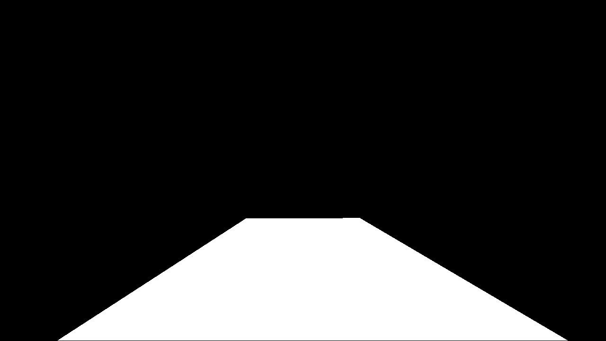

# Advanced Lane Lines

This project is part of the Udacity Self-Driving Car Engineer Nanodegree program. The project base code can be found under [https://github.com/udacity/CarND-Advanced-Lane-Lines](https://github.com/udacity/CarND-Advanced-Lane-Lines). 

The project is run on a highway video which can be downloaded [here](https://github.com/udacity/CarND-Advanced-Lane-Lines/blob/master/project_video.mp4)


## Project goals

The purpose of this project is to identify road lane lines in a video file in order to give a self-driving car the ability to see its environment and steer safely within the lane. The project code is structured as a pipeline of processing steps in the following order:

* Compute the camera calibration matrix and distortion coefficients given a set of chessboard images.
* Apply a distortion correction to raw images
* Use color transforms, gradients, etc., to create a thresholded binary image.
* Apply a perspective transform to rectify binary image ("birds-eye view").
* Detect lane pixels and fit to find the lane boundary.
* Determine the curvature of the lane and vehicle position with respect to center.
* Warp the detected lane boundaries back onto the original image.
* Output visual display of the lane boundaries and numerical estimation of lane curvature and vehicle position.

[//]: # (Image References)

[image1]: ./output_images/calibration1.jpg "Distorted"
[image2]: ./output_images/undist_0.jpg "Undistorted"
[image3]: ./output_images/Region_mask.jpg "Mask for area of interest"
[image4]: ./output_images/ColorThresholdingExample.png "Pipeline with difficult input image"
[image5]: ./output_images/perspective_transform.png "4 points used for perspective transformation"
[image6]: ./output_images/warped_before_after.jpg "Image before and after warping"
[image7]: ./output_images/example_output_lane.jpg "One frame with lane detection"
[image8]: ./output_images/LUV_Thresholding.jpg "LUV L channel image with noise"
[image9]: ./output_images/combined_before_after.jpg
[video1]: ./output_final.mp4 "Video"


## Camera Calibration

All camera lenses come with a certain distortion coming from the curvature of the lens. The wider the field of view of the lens, the more distorted the image. This presents challenges to algorithms that require objects in the image to have the same properties as in the real world: straight lines need to be straight, parallel lines have to be parallel, etc. In order to correct the distortion from the lens, a calibration of the specific camera/lens combination needs to be carried out.

 
Central to the calibration procedure is the mapping from object points to image points. The object points are virtual points, each one equalling to an edge in the image plane in the chessboard image. 

The calibration mainly consists of the OpenCV functions findChessboardCorners and calibrateCamera. Chessboard images are used to find intersection lines between black and white squares. These points will be used to calculate the mapping from image space (distorted) to object space. For the distortion calculation, a total of 20 images are used. OpenCV::calibrateCamera then calculates the two matrices mtx (camera matrix) and dist (distortion coefficients), which are later used to undistort the images from the video.


### Pipeline

#### Thresholded images

In order to extract lane markers from images, thresholding on color intensities is used, because lane markers have very distinct values, especially when using an appropriate color space.

The function hls_rgb_threshold takes in an image, a regional masking and three color value threshold for different color channels.
```
def hls_rgb_threshold(img, region_thresholds, s_thresh = (0, 255), l_thresh = (0, 255), rg_thresh = (0, 255)):
```

- Image: A single image from the video in BGR color space (standard OpenCV format)
- region_thresholds: Area of interest where the lane lines are located. See below the masked area in white vs. the rest of the picture in black, which is discarded
- s_thresh, l_thresh, rg_thresh: Thresholds for the S and L channel of the HLS color space, as well as the R and G channel of the BGR color space. The R and G channel work very well with the bright yellow image lane (red plus green = yellow), the S channel works well with the yellow lane as well under difficult light conditions, and the L channel in general works well with high brightness and disturbance in the color spectrum

<center></center>

Here is an example of the transformation on a difficult input image  On the very left is the (masked) input image which has different colors of asphalt and bright light conditions. The R and G channels of the BGR color spectrum are apparently not very suitable for these conditions, there are lots of false detections in the middle of the lane, and the left lane has a lot of noise. The L channel of HLS picks up almost nothing of the lane. The best channel is actually the S channel of HLS, because it is very suitable for the yellow left boundary lane.

![alt text][image4]

For thresholding, a dynamic calculation per frame is applied, meaning for every image an average brightness is calculated and the threshold set at 30% higher than the average. This serves as a brightness normalization, and with this much better results are achieved in the difficult parts of the video where brightness is changing rapidly.

#### UPDATE 15.05.2017
After experiencing problems with the color spaces R and G of RGB, L and S of HLS, the pipeline was redesigned to now use the B Channel of Lab, S channel of HLS and L channel of LUV. The thresholds are set slightly differently to calculate a total brightness per image. If the total brightness exceeds a threshold, this channel will not be used for the combined image. 

![alt text][image8]

In this example, on the very left, you can see a proper image of the right lane, total brightness is about "5000". The second picture has significant noise, total brightness around 200,000. The third image has maximum brightness of about 330,000. The final one has minimal noise and brightness of about 30,000. Using these examples, the threshold was set to 40,000, so that images that are slightly noisy will still be detected, but unusable images discarded.

Below you can see the effect of the changes on another sample image from frame 61. On the left is the initial pipeline (RG, L, S), generating a lot of noise which is not suitable for detection. On the right is the new pipeline (B, S, L) with much more suitable lanes for detection. Altogether, the detection works much smoother now than before.

![image9]


#### Perspective transformation

This transformation makes sure that parallel lines in the image are drawn as parallel by transforming to a "bird's eye view". This is done by a transformation matrix using 4 points from the real image space as seen below.

![alt text][image5]


| Source        | Destination   | 
|---------------|---------------| 
| 570, 465      | 320, 0        | 
| 712, 465      | 960, 0        |
| 253, 677      | 320, 719      |
| 1054, 677     | 960, 719      |

As you can see, the straight left line of the image (x1=253, x2=570) are transformed to the exact same x=320 so that they will be parallel. Below you can see the result of the perspective transformation on one of the sample images. The lanes are straight and parallel in the original, and this behaviour can also be observed in the warped image, which (in its "thresholded" version) can then be used to identify the lane lines.

![alt text][image6]

#### Find lane pixels and fit a function

Lane pixels are identified in the following functions

```
def new_search_window(undist, warped):
```

```
def follow_search_window(warped, left_fit, right_fit, margin=100):
```

The new search windows applies a histogram for initially looking for the area of interest around which the search windows for lane pixels are positioned. For this, the function separates the image into a left and a right half (exactly in the middle of the image, which makes sense if you drive centered in the lane, and the camera is centered in the car - the center of left and right lane should then be perfectly in the middle of the image). 

The number of search windows vertically should not be too large in order to fit a polynomial fit well, or otherwise some fragments left and right of the lane may have a larger impact on distracting one of the search windows, which may lead the lane fit off track.

Most pixels in the thresholded image are black, and numpy::nonzero will return only those indices of the pixels of interest. Of course, some noise will also be in there. The better the thresholding works, the better this function can identify the correct lane pixels. These pixels are then separated in two arrays for their x and their y value.

Afterwards, the search windows are looped through. The first search windows starts at the bottom of the image. The outer borders (left, right, bottom, top) of the left and right lane search windows are defined, and all nonzero values within this search window are found and added to left_lane_indx and right_lane_indx. If the minimum amount of pixels per search window minpix is exceeded, the x position for the center of the search window is then reset to this new position. The minpix amount serves as a kind of quality control to make sure that only good lanes are detected, if not, something should be wrong in the image.

The follow_search_window function provides a faster approach when a previous lane fit is available. It therefore takes in the previous lane fits as well as a margin (left and right search width). Here, it simply calculates the pixels associated with the lane fit, looks left and right of this fit with the margin given, and returns all nonzero elements found within this area. In the end, a new fit based on the newly found points is calculated and returned.


#### Example lane detection

After applying the whole pipeline, the output looks as follows.

![alt text][image7]